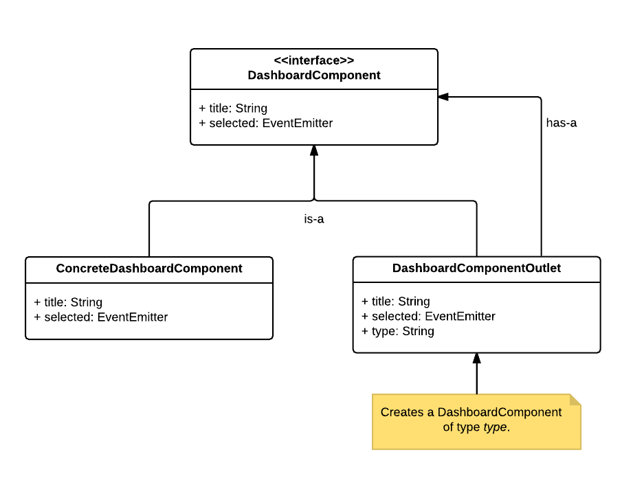

# Dynamic Dashboard Sample for Angular 2

Shows how to dynamically create Components for a Dashboard. Therefore it uses the Proxy-Pattern. The ``DashboardComponentOutlet`` represents a proxy that dynamically load a defined component.

More Infos about Angular 2 can be found at [www.softwarearchitekt.at](http://www.softwarearchitekt.at)